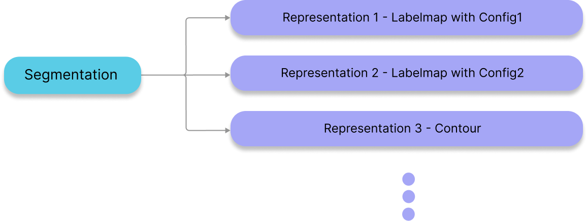
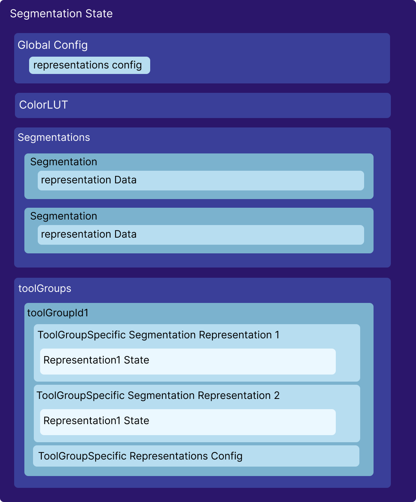
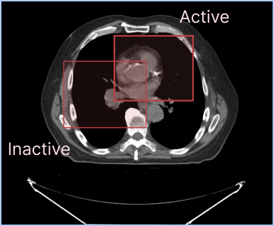
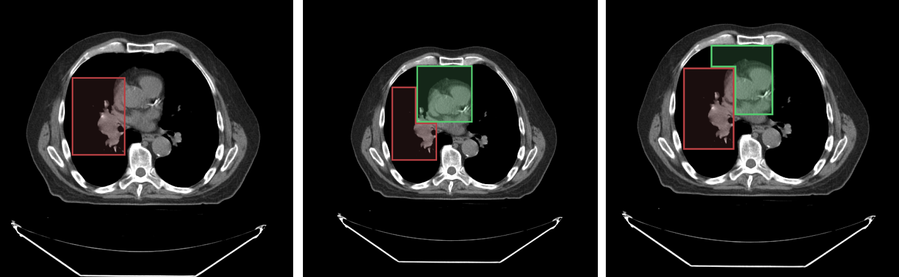
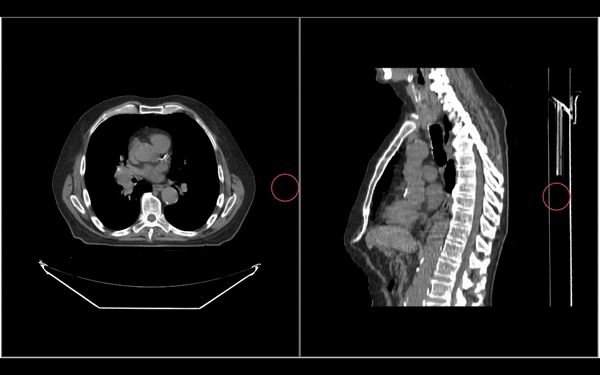
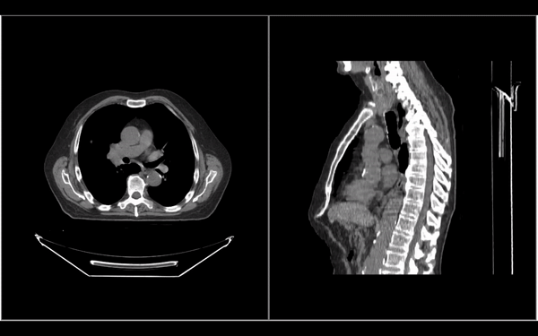
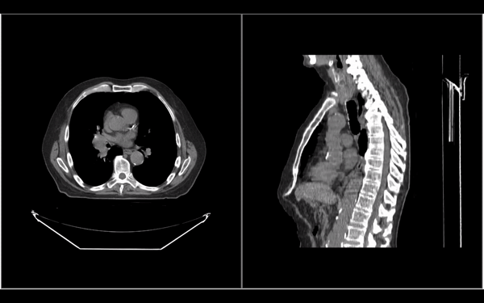
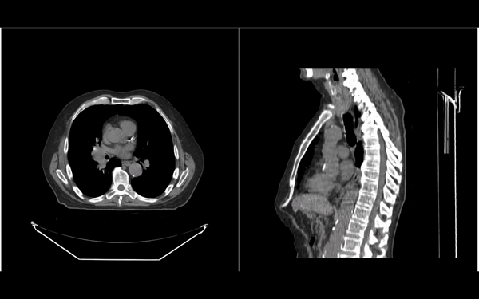
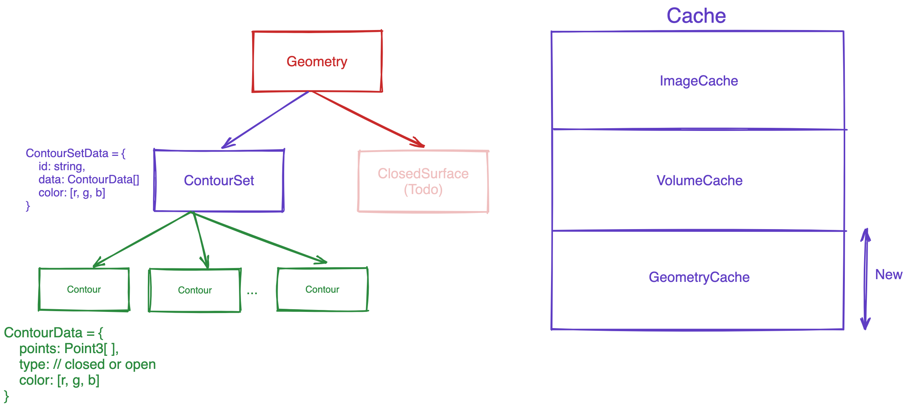

# Sementation

Cornerstone3DTools では、 Segmentation の概念を Segmentation Representation から切り離しました。
これは 1 つの Segmentation から複数の Segmentation Representation を作成できることを意味します。
たとえば
3D ラベルマップの Segmentation Representation は一つの Segmentation データから作成でき、
輪郭 (まだサポートされていません) の Segmentation Representation は同じ Segmentation データから作成できます。このようにして、 Segmentation のプレゼンテーションの側面を基礎となるデータから切り離すことができます。



### ヒント

同様の関係構造は、ポリモーフセグメンテーションが追加された 3D スライサーなどの一般的な医療画像ソフトウェアにも採用されています。

## ToolGroup Specific Representations

以前 Cornerstone (legacy)においては、Segmentations を要素に適用しました。
これには独自の制限がありました。
例えば、各ビューポート (ct-アキシャル、ct-サジタル、ct-コロナル) において、Segmentitions を繰り返し作成するときなど。

これを変更して RepresentationToolGroup を Segmentation に適用し、それに応じてすべてのビューポートに適用します。

## Segmentation Representation

Cornerstone3DTools は、他のツールと同じ方法でセグメンテーションを処理します。

たとえば addTools 介して SegmentationDisplayTool が追加される必要があり、
segmentation を表示したい Viewports を有する ToolGroup が追加される必要があります。

## API

関数と関連する Segmentation とクラスは segmentation モジュールで使用できます。

```
import { segmentation } from '@cornerstonejs/tools';

// すべてのセグメンテーションとそのツールグループ固有の表現を保持するセグメンテーション状態

segmentations.state.XYZ;

// アクティブセグメンテーションメソッド (set/get)
segmentations.activeSegmentation.XYZ;

// セグメント・インデックスのロック（設定/取得）
segmentations.locking.XYZ;

// セグメント・インデックスの操作（設定/取得）
segmentations.segmentIndex.XYZ;
```

まずは、それぞれの方法について詳しく見てみよう。

## State

SegmentationState はライブラリ内の Segmentations の現在の state と SegmentationRepresentation に関するすべての情報を保存します。

前のセクションで述べたように、Segmentation と SegmentationRepresentation は互いに分離れています。
Segmentation からさまざまな表現を作成できます (ラベルマップは現在サポートされています)。
したがって State にセグメンテーションとそのツールグループ固有の表現もそれぞれ分けて保存します。

State の概要を以下に示します。



## Global Config

Cornerstone3DTools は 2 つの構成を実装しており、それぞれを個別に設定できます。
state の中の GlobalConfig には、すべてのツールグループのすべてのセグメンテーション表現のグローバル構成が保存されます。

それぞれを個別に設定する方法について詳しくは、[config](https://www.cornerstonejs.org/docs/concepts/cornerstone-tools/segmentation/config)を参照してください。

## ColorLUT

SegmentationState はセグメンテーション表現のレンダリングに使用される colorLUT の配列を格納します。
Cornerstone3DTools は最初にこの配列の最初のインデックスとして 255 色 ( [ [0,0,0,0], [221, 84, 84, 255],[77, 228, 121, 255], ... ]) を追加します。
デフォルトではすべてのセグメンテーション表現で最初の colorLUT が使用されます。
ただし config のなかのカラー API を使いしながらグローバル colorLUT に色を追加したり,
あるいは特定のセグメンテーション表現のための colorLUT に変更できます。

## Segmentations

Segmentation には SegmentationState すべてのセグメンテーションを配列で保存します。
Segmentation と SegmentationRepresentation は 2 つの別個の概念であることに注意してください。
ステート内の各セグメンテーションオブジェクトには、 SegmentationRepresentation を作成するために必要なすべての情報が格納されます。

各セグメンテーション オブジェクトには次のプロパティがあります。

```
{
  segmentationId: 'segmentation1',
  mainType: 'Labelmap',
  activeSegmentIndex: 0,
  segmentsLocked: new Set(),
  label: 'segmentation1',
  cachedStats: {},
  representationData: {
    LABELMAP: {
      volumeId: 'segmentation1',
    },
    CONTOUR: {
      geometryIds: ['contourSet1', 'contourSet2'],
    },
  },
},
```

- segmentationId: 消費者によって提供される必須フィールド。これはセグメンテーションの一意の識別子です。
- mainType: 内部的に設定されます。デフォルトでは「Labelmap」
- activeSegmentIndex: ツールによってセグメンテーションのデータを変更するために使用されるアクティブなセグメントインデックス。
- segmentsLocked: ツールによって変更されない、ロックされたセグメント インデックスのセット。
- label: セグメンテーションのラベル。
- cachedStats: セグメンテーションの統計情報のキャッシュ (ボリュームなど - 現在は使用されていません)
- representationData:最も重要な部分、これは SegmentationRepresentation を作成するためのデータが保存される場所です。たとえば、LABELMAP 表現では、SegmentationRepresentation を作成するために必要な情報はキャッシュされた volumeId です。

## Adding Segmentations to the State

Segmentation と は SegmentationRepresentation 互いに分離されているため、まず、segmentation 状態に を追加する必要があります。これはトップレベル API によって実行できます。

```
import { segmentation, Enums } from '@cornerstonejs/tools';

segmentation.addSegmentations([
  {
    segmentationId,
    representation: {
      type: Enums.SegmentationRepresentations.Labelmap,
      data: {
        volumeId: segmentationId,
      },
    },
  },
]);
```

ご覧のとおり segmentationId や
SegmentationRepresentation の作成に必要なタイプとデータの入った representation
を含む、セグメンテーションの配列を state に追加します。

### 重要

state に Segmentation を追加しても、セグメンテーションはレンダリングされません。
SegmentationRepresentation を、
セグメンテーション表現 (Labelmap など) をレンダリングすることを目的とした toolsGroup に
追加する必要があります。
以下でその方法を見ていきます。

## ToolGroups

SegmentationDisplayTool は、セグメンテーション表現を表示する役割を担う Cornerstone3DTools の内部ツールです。それぞれの Segmentation から、ToolGroup が SegmentationRepresentation を作成し表示できます。

## SegmentationRepresentation を ToolGroup に追加する

次に SegmentationRepresentation を ToolGroup に追加する必要があります。
これは、Segmentation モジュールの addSegmentationRepresentation メソッドを使用して実行できます。このようにして ToolGroup に追加されたすべてのビューポートは、新しい SegmentationRepresentation を含むようにレンダラが更新されます。

```
import {
  segmentation,
  SegmentationDisplayTool,
  Enums,
} from '@cornerstonejs/tools';

/**
 * Setup toolGroups and addViewports to them before hand
 */

const toolGroup = ToolGroupManager.getToolGroup(toolGroupId);

toolGroup.addTool(SegmentationDisplayTool.toolName);
toolGroup.setToolEnabled(SegmentationDisplayTool.toolName);

await segmentation.addSegmentationRepresentations(toolGroupId, [
  {
    segmentationId,
    type: Enums.SegmentationRepresentations.Labelmap,
  },
]);
```

または、ToolGroup が特定の構成を使用してセグメンテーション表現を表示している場合は、それを最後の引数で指定できます。

```
const toolGroupSpecificRepresentationConfig = {
  renderInactiveSegmentations: true,
  representations: {
    [Enums.SegmentationRepresentations.Labelmap]: {
      renderOutline: true,
    },
  },
};

await segmentation.addSegmentationRepresentations(
  toolGroupId,
  [
    {
      segmentationId,
      type: Enums.SegmentationRepresentations.Labelmap,
    },
  ],
  toolGroupSpecificRepresentationConfig
);
```

# 構成 config

セグメンテーション表現に適用できる構成には 2 つのタイプがあります。

-グローバル構成: すべてのツールグループ内のすべてのセグメンテーション表現の構成。
-ToolGroup 固有の構成: 各 toolsGroup の構成。グローバル構成をオーバーライドします。

構成の種類に関係なく、各表現構成を含むオブジェクトです。

```
{
  renderInactiveSegmentations: false,
  representations: {
    LABELMAP: {
      renderFill: true,
      renderOutline: true,
      // other related labelmap-specific
    },
    CONTOUR: {
      // contour-specific configuration
      // contours are not implemented yet, see our roadmap for more details
    },
  },
},

```

### 重要

ToolGroup 固有の構成は常にグローバル構成をオーバーライドします。

たとえば、グローバル構成のみが設定されている次の状況があるとします。

```
const globalConfiguration = {
  renderInactiveSegmentations: false,
};

// Results: Cornerstone3DTools WILL NOT render inactive segmentations
```

toolGroup 固有の構成がある場合は、次のようになります。

```
const globalConfiguration = {
  renderInactiveSegmentations: false,
};

const toolGroupConfiguration = {
  renderInactiveSegmentations: true,
};

// Results: Cornerstone3DTools WILL render inactive segmentations
```

## Config State API

セグメンテーション表現構成の API は次のとおりです。

```
import {segmentation, Enums} from '@cornerstonejs/tools

// Get the global configuration
segmentation.config.getGlobalConfig()

// Set the global configuration
segmentation.config.setGlobalConfig(config)

// Get toolGroup-specific configuration
segmentation.config.getToolGroupSpecificConfig(toolGroupId)

// Set toolGroup-specific configuration
segmentation.config.setToolGroupSpecificConfig(toolGroupId, config)

// Get global representation configuration for a specific representation (e.g., labelmap)
const representationType = Enums.SegmentationRepresentations.Labelmap
segmentation.config.getGlobalRepresentationConfig(representationType)

// Set global representation configuration for a specific representation (e.g., labelmap)
segmentation.config.setGlobalRepresentationConfig(representationType, config)
```

ヒント
Cornerstone3DTools が提供するラベルマップ構成オプション詳細については、[こちら](https://www.cornerstonejs.org/api/tools/namespace/Types#LabelmapConfig)をご覧ください

## 可視性 API

Segmentation モジュールは、各セグメンテーション表現の可視性を設定/取得するための API を提供します。visibilityAPI を使用して、各表現を非表示/表示することができます 。

```
import { segmentation } from '@cornerstonejs/tools

// set the visibility of a segmentation representation for a toolGroup
segmentation.config.visibility.setSegmentationVisibility(toolGroupId, representationUID, visibility)

// get the visibility of a segmentation representation for a toolGroup
segmentation.config.visibility.getSegmentationVisibility(toolGroupId, representationUID)
```

## Color API

colorLUT(カラー ルックアップ テーブル (LUT))を追加するための API を提供します。
セグメンテーション表現がセグメントをレンダリングするために acolorLUT を使います。
colorLUT は各セグメントのレンダリングに使用される RGBA 値の配列です。
たとえば、
segment index 0(背景) は配列の最初の項目 (colorLUT [0] )を使用し、
colorLUTsegment index 1(最初のセグメント) は配列の 2 番目の項目 (colorLUT [1] ) を使用します。

### 重要

Segmentation State は配列に加えられたすべての colorLUT を追跡します
(これにより、そのセグメンテーション表現における状態での colorLUT エントリを配列の配列します。
)。
したがって、colorLUT を変更するには、使用する colorLUT のインデックスも指定する必要があります。

```
import { segmentation } from '@cornerstonejs/tools

// add color LUT for use with a segmentation representation
segmentation.config.color.addColorLUT(colorLUT, colorLUTIndex)

// sets the colorLUT index to use for the segmentation representation
segmentation.config.color.setColorLUT(toolGroupId, representationUID, colorLUTIndex)

// get the color for the segment index
segmentation.config.color.getColorForSegmentIndex(toolGroupId, representationUID, segmentIndex)
```

# Segmentation Display Tool

SegmentationDisplayTool は Cornerstone3DTools 内部のツールです。
他のツールと同様に、最初にツールを addTools 介して
次にセグメンテーションの表示するために ToolGroup に追加する必要があります。

## 使用方法

以下では、ラベルマップ セグメンテーション表現を表示するために、
SegmentationDisplayTool の使い方を示します。

```
import {
  addTool,
  segmentation,
  SegmentationDisplayTool,
  ToolGroupManager,
} from '@cornerstonejs/tools';

const segmentationId = 'segmentationId';
const toolGroupId = 'segmentation-display-tool-group';
const viewportId = 'segmentation-display-viewport';

// Adding it to internal state of cs3DTools
addTool(SegmentationDisplayTool);

const toolGroup = ToolGroupManager.createToolGroup(toolGroupId);

// adding viewports to the toolGroup
toolGroup.addViewport(viewportId);

// adding tool to the toolGroup
toolGroup.addTool(SegmentationDisplayTool.toolName);

// setting tool to enabled in order to be show the segmentations
toolGroup.setToolEnabled(SegmentationDisplayTool.toolName);

// adding the segmentation to cornerstone3DTools segmentation state
segmentation.addSegmentations([
  {
    segmentationId,
    representation: {
      type: Enums.SegmentationRepresentations.Labelmap,
      data: {
        volumeId: segmentationId,
      },
    },
  },
]);

// create a labelmap representation of the segmentation and add it to the toolGroup
await segmentation.addSegmentationRepresentations(
  toolGroupId,
  [
    {
      segmentationId,
      type: Enums.SegmentationRepresentations.Labelmap,
    },
  ],
  toolGroupSpecificRepresentationConfig
);
```

# Active Segmentation

各 ToolGroup は同時に Segmentation Representation を複数表示できます。
ただし、active なセグメンテーション表現は 1 つだけです。
この active セグメンテーション表現は、セグメンテーション ツールによって使用されているものです。

アクティブなセグメンテーション表現と非アクティブなセグメンテーション表現に異なる構成を設定できます。
たとえば、ラベルマップの場合、
アクティブなセグメンテーション表現と非アクティブなセグメンテーション表現を
renderFill および renderOutline プロパティを個別に設定できます。



上の図にあるように、2 つの異なるラベルマップを同時に表示できます。アクティブなセグメンテーション表現のデフォルト設定では、アクティブなセグメンテーション表現をより見やすくするために、非アクティブなセグメンテーション表現よりもアウトライン幅の値が大きくなります。

アクティブ セグメンテーション API は、アクティブ セグメンテーション表現のセッターとゲッターを提供します。

```
import { segmentation } from '@cornerstonejs/tools';

// get the active segmentation representation for a toolGroup
segmentation.getActiveSegmentationRepresentation(toolGroupId);

// set the active segmentation representation for a toolGroup
segmentation.setActiveSegmentationRepresentation(
  toolGroupId,
  representationUID
);
```

# Segment Locking

セグメンテーション内のセグメント インデックスをロックして、どのツールでも変更できないようにすることができます。

例として、ラベルマップがオーバーレイされた次の画像を考えてみましょう。

左の画像は segment index 1 を示し、
中央の画像は segment index 2 を segment index 1 の上に描画した場合の結果を示し、
右の画像は segment index 1 をロックして segment index 2 を segment index 1 の上に描画した場合の結果を示します。ロックされたシナリオ (右の図) でわかるように、セグメント インデックス 1 は新しい描画にっよって変更されません。



## API

```
import { segmentation } from '@cornerstonejs/tools';

// For locking a segment index on a segmentation
segmentation.locking.setSegmentIndexLocked(
  segmentationId,
  segmentIndex,
  locked
);

// Getting all the locked segments for a segmentation
segmentation.locking.getLockedSegments(segmentationId);

// Check if the segment index in the segmentation is locked
segmentation.locking.isSegmentIndexLocked(
  segmentationId,
  segmentIndex
);
```

# Segment Index

セグメンテーション ツールを使用して描画する場合、使用するセグメント インデックスを指定できます。以下では、SegmentIndex API を使用して segmentIndex を変更し、2 番目のセグメントを描画します。

https://www.cornerstonejs.org/docs/concepts/cornerstone-tools/segmentation/segment-index

## API

```
import { segmentation } from '@cornerstonejs/tools';

// get active segment index for the segmentation Id
segmentation.segmentIndex.getActiveSegmentIndex(segmentationId);

// set active segment index for the segmentation Id
segmentation.segmentIndex.setActiveSegmentIndex(segmentationId, segmentIndex);
```

# Segmentation Tools

Cornerstone3DTools はセグメンテーションを変更するためのツールのセットを提供します。
これらには、BrushTool、ScissorTool（RectangleScissor, CircleScissor, SphereScissor など）、RectangleRoiThresholdTool が含まれます。

以下で各ツールについて詳しく説明します。

## ヒント

すべてのセグメンテーション ツールは、すべての 3D ビュー (アキシャル、コロナル、サジタル) でセグメンテーションを編集できます。

## BrushTool

BrushTool はセグメンテーションで最もよく使用されるツールです。
クリックしてドラッグすることでセグメンテーションを描画できます (以下を参照)。

このツールを使用するには、他のツールと同様に、toolGroup に追加する必要があります。
ツールをアクティブにする方法の詳細については、[ツール](https://www.cornerstonejs.org/docs/concepts/cornerstone-tools/tools#adding-tools)セクションと[ツールグループ](https://www.cornerstonejs.org/docs/concepts/cornerstone-tools/toolGroups#toolgroup-creation-and-tool-addition)セクションを参照してください。

[クリック](https://www.cornerstonejs.org/assets/images/brush-tool-53ac2a5c6cd961d35a3d689f754f282a.gif)



## Rectangle Scissor Tool

RectangleScissorTool は長方形のセグメンテーションを作成するために使用できます。

[クリック](https://www.cornerstonejs.org/assets/images/rectangle-scissor-1e8a71a6660a82962a3adea1659111f3.gif)



## Circle Scissor Tool

CircleScissorTool は円形のセグメンテーションを作成するために使用できます。

[クリック](https://www.cornerstonejs.org/assets/images/circle-scissor-06f8adc46d9763cc660ce28588dfcc00.gif)


## Sphere Scissor Tool

SphereScissorTool は球状のセグメンテーションを作成するために使用できます。マウス ポインタの周囲に 3D 球体を描画します。

[クリック](https://www.cornerstonejs.org/assets/images/sphere-scissor-20323a5493cc9f1458d48f7fe5d70b1e.gif)



## Threshold Tool

RectangleROIThresholdTool はユーザーが描画領域をしきい値処理することでセグメンテーションを作成するために使用できます。

(以下の画像では、セグメンテーションを作成するために特定のしきい値が設定されています)

[クリック](https://www.cornerstonejs.org/assets/images/threshold-segmentation-tool-2a3152b7981c37334c5c6586df114410.gif)



# Contour Segmentation Representation

輪郭セグメンテーション表現は、輪郭セットのコレクションです。
各輪郭セットは輪郭のコレクションです。
各輪郭は点の集合です。
各ポイントは 3D 座標の集合です。



## Contour Set

通常、セグメンテーションは複数の構造の集合であるため、各輪郭セットは単一の構造を表します。
たとえば、セグメンテーションには複数の輪郭セットを含めることができ、それぞれが異なる構造を表します。
各輪郭セットには一意の ID と名前があります。
この名前は、UI に構造名を表示するために使用されます。

## Contour

輪郭には、輪郭を構成する点に関する情報が含まれます。各輪郭にはデータ、タイプ (閉じているか開いているか)、および色があります。

## Segmentation Representationとして　Contourをロードする

```
// load each contour set and cache the geometry
const promises = contourSets.map((contourSet) => {
  return geometryLoader.createAndCacheGeometry(contourSet.id, {
    type: GeometryType.CONTOUR,
    geometryData: contourSet as Types.PublicContourSetData,
  });
});

await Promise.all(promises);

// Add the segmentations to state
segmentation.addSegmentations([
  {
    segmentationId,
    representation: {
      // The type of segmentation
      type: csToolsEnums.SegmentationRepresentations.Contour,
      // The actual segmentation data, in the case of contour geometry
      // this is a reference to the geometry data
      data: {
        geometryIds: contourSets.map((contourSet) => contourSet.id),
      },
    },
  },
]);

// add segmentation representation
await segmentation.addSegmentationRepresentations(toolGroupId, [
  {
    segmentationId,
    type: csToolsEnums.SegmentationRepresentations.Contour,
  },
]);
```
